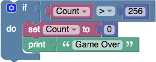
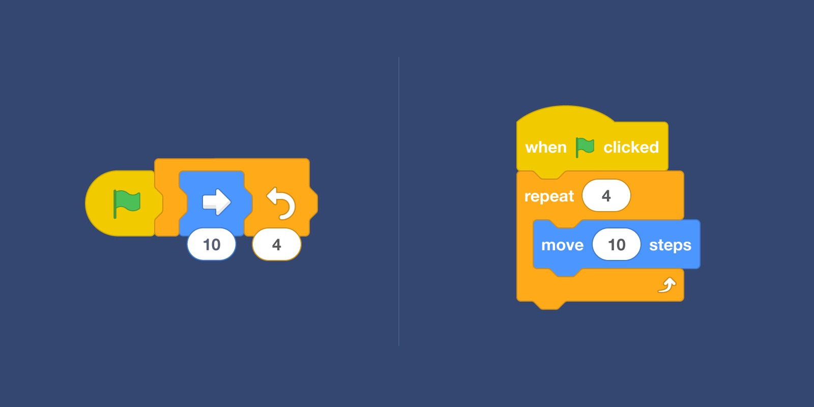
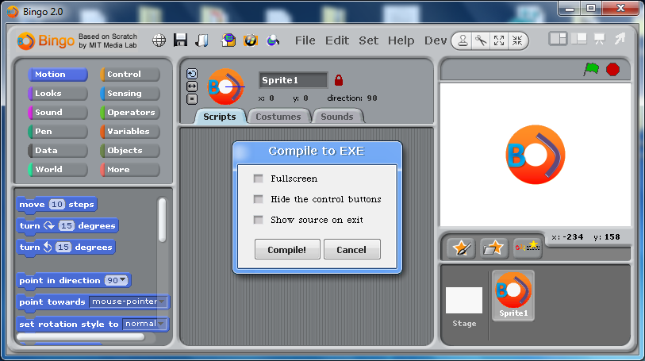
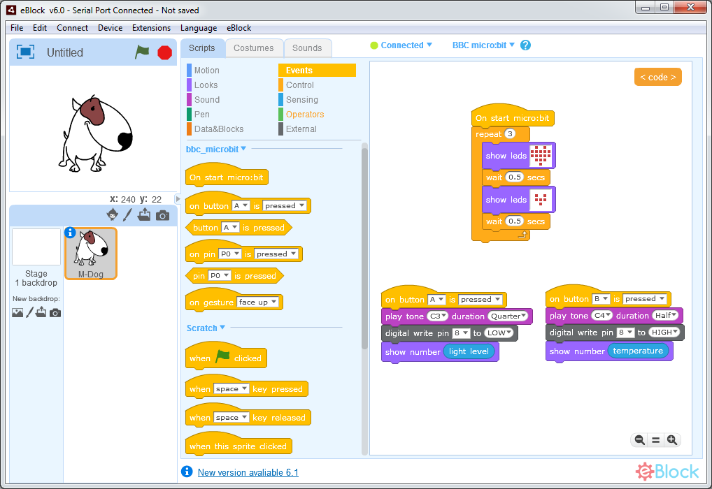
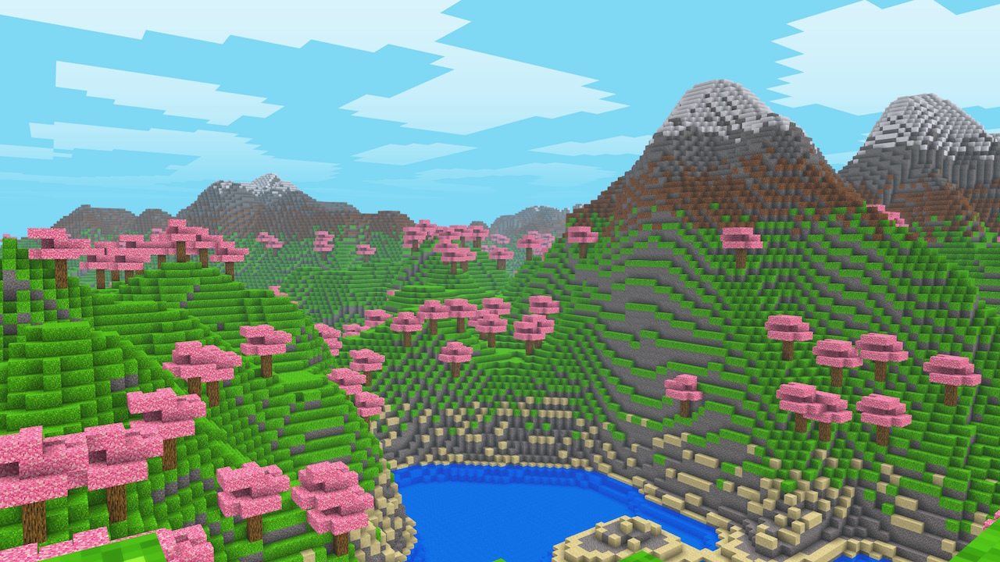
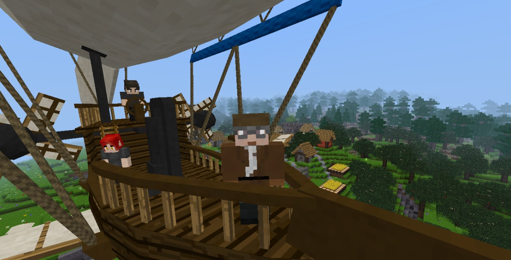

# AweSome

Just another awsome

# Nintendo Emulator

1. [nes](https://github.com/fogleman/nes). NES emulator written in Go using opengl.
2. [Fergulator](https://github.com/scottferg/Fergulator). NES emulator, written in Go.
3. [nintengo](https://github.com/nwidger/nintengo). An NES emulator written in Go using Azul3d (opengl).
4. [chibines](https://github.com/kaishuu0123/chibines), was [toynes](https://github.com/kaishuu0123/toynes). NES emulator & NSF Player written in Go.
   [ToyNES (NES Emulator & NSF Player. written in Go)](https://www.reddit.com/r/EmuDev/comments/vmc9p2/toynes_nes_emulator_nsf_player_written_in_go/)
5. [famigo](https://github.com/theinternetftw/famigo). NES emulator using [shiny](https://pkg.go.dev/golang.org/x/exp/shiny).
6. [LaiNES](https://github.sre.pub/AndreaOrru/LaiNES). Cycle-accurate NES emulator in ~1000 lines of code in C++.

# Game Boy emulator

1. [goboy](https://github.com/Humpheh/goboy). Multi-platform Nintendo Game Boy Color emulator written in Go.
2. [termboy-go](https://github.com/dobyrch/termboy-go). Gameboy emulator which runs graphically in the terminal.
3. [dmgo](https://github.com/theinternetftw/dmgo). A gameboy emulator in go. Gameboy emulator
   uses [shiny](https://pkg.go.dev/golang.org/x/exp/shiny).
4. [demo-emulator](https://github.com/drhelius/demo-emulator). Nintendo Game Boy emulator written in Go to be used
   in workshops about emulator programming. Gameboy emulator using opengl.

# GBA Emulator

1. [magia](https://github.com/pokemium/magia). magia is a toy GBA emulator written in golang.

# NDS emulator

1. [ndsemu](https://github.com/rasky/ndsemu).  Nintendo DS Emulator written in Go.

# Other Emulator.

1. [chip8](https://github.com/bomer/chip8). CHIP8 emulator using gomobile (opengl).

# 2D & 3D Game Library Golang

1. [ebiten](https://github.com/hajimehoshi/ebiten). Ebitengine - A dead simple 2D game library for Go.
2. [imgui-go](https://github.com/inkyblackness/imgui-go). Go wrapper library for "Dear ImGui" (https://github.com/ocornut/imgui).
3. [cimgui-go](https://github.com/AllenDang/cimgui-go). Auto generated Go wrapper for Dear ImGui via cimgui.
4. [glfw](https://github.com/go-gl/glfw). Go bindings for GLFW 3.
5. [go-sdl2](https://github.com/veandco/go-sdl2). SDL2 binding for Go.
6. [pixel](https://github.com/faiface/pixel). A hand-crafted 2D game library in Go.

# Game Engine

1. [axmol](https://github.com/axmolengine/axmol). Axmol Engine – A Multi-platform Engine for Desktop, XBOX (UWP) and Mobile games. (A fork of Cocos2d-x-4.0)

# MIDI

1. [go-meltysynth](https://github.com/sinshu/go-meltysynth). A SoundFont MIDI synthesizer written in pure Golang,
   ported from [MeltySynth for C#](https://github.com/sinshu/meltysynth).

# DirectX Wrapper & Hook

1. [dxvk](https://github.com/doitsujin/dxvk). Vulkan-based implementation of D3D9, D3D10 and D3D11 for Linux / Wine (and Win10)
2. [dgVoodoo2](https://github.com/dege-diosg/dgVoodoo2). Glide/DirectX implementation on D3D11/12. No source code.
   [About](http://dege.freeweb.hu/dgVoodoo2).
3. [dxgl](https://github.com/dxgldotorg/dxgl). DXGL DirectX-to-OpenGL Wrapper source code.
4. [Wrappers](https://emulation.gametechwiki.com/index.php/Wrappers) page.
5. [Proton](https://github.com/ValveSoftware/Proton). Compatibility tool for Steam Play based on Wine and additional components.
6. [dxsdk](https://github.com/apitrace/dxsdk). Collection of DirectX SDK headers to facilitate the build of Apitrace.
7. [A3D-Live-](https://github.com/RazorbladeByte/A3D-Live-). A3D to DirectSound3D Wrapper. [A3D 3.0 API Reference Guide](http://www.worknd.ru/a3d30ref.pdf)
8. [dxwrapper](https://github.com/jarikomppa/dxwrapper). DirectX 1-7 wrapper project for making old games run on new hardware.
9. [openglide2](https://github.com/RazorbladeByte/openglide2). a glide2-to-OpenGL wrapper based on OpenGLide.
10. [cnc-ddraw](https://github.com/CnCNet/cnc-ddraw). GDI, OpenGL and Direct3D 9 re-implementation of the DirectDraw API
   for classic games for better compatibility with Windows XP, Vista, 7, 8, 10, 11 and Wine.
11. [DDrawCompat](https://github.com/narzoul/DDrawCompat). DirectDraw compatibility and performance enhancements for Windows Vista, 7, 8 and 10.
12. [simpledllloader](https://github.com/aap/simpledllloader). A simple DLL loader for games. Derived from the Ultimate ASI loader.
13. [DxWnd](https://github.com/DxWnd/DxWnd.reloaded). Windows hooker - intercepts system calls to make fullscreen programs running in a window,
    to support a better compatibility, to enhance video modes and to stretch timing. It is tipically very useful to run old windows games.

# Hacking

1. [pe](https://github.com/saferwall/pe). A ⚡ lightweight Go package to parse, analyze and extract metadata from Portable Executable (PE) binaries.
   Designed for malware analysis tasks and robust against PE malformations.
2. [unicorn](https://pkg.go.dev/github.com/unicorn-engine/unicorn/bindings/go/unicorn). Unicorn CPU emulator framework
   (ARM, AArch64, M68K, Mips, Sparc, PowerPC, RiscV, S390x, TriCore, X86).
4. [DllInjector.c](https://gist.github.com/apsun/1adb6557a44ea8372e7cc27c3ad827ad). A simple Windows 32-bit DLL injector.
   Other [dll-injector topics](https://github.com/topics/dll-injector)
4. [usercorn](https://github.com/lunixbochs/usercorn). dynamic binary analysis via platform emulation in Go.
5. [Unicorn Engine Notes](https://github.com/alexander-hanel/unicorn-engine-notes).
6. [debug/pe](https://pkg.go.dev/debug/pe). Package pe implements access to PE (Microsoft Windows Portable Executable) files.
7. [pefile-go](https://github.com/willscott/pefile-go). Python's pefile porting to Go after many forks.
8. [Locale-Emulator-Core MyLibrary](https://github.com/xupefei/Locale-Emulator-Core/blob/master/LocaleEmulator/ml.cpp).
9. [speakeasy](https://github.com/mandiant/speakeasy). Windows kernel and user mode emulation in Python with Unicorn.
10. [SoftWire](https://github.com/evilsocket/SoftWire) (2009). SoftWire is a class library written in object-oriented C++ for compiling assembly code.
    It can be used in projects to generate x86 machine code at run-time as an alternative to self-modifying code.
    Scripting languages might also benefit by using SoftWire as a JIT-compiler back-end. …
11. [Unity-game-hacking](https://github.com/imadr/Unity-game-hacking). A guide for hacking unity games, plus tools.
12. [game-hacking](https://github.com/dsasmblr/game-hacking). Tutorials, tools, and more as related to reverse engineering video games.

# Decompiler

1. [reko](https://github.com/uxmal/reko). Reko is a binary decompiler using C#.
2. [snowman](https://github.com/yegord/snowman). Snowman decompiler using C++.
3. [plasma](https://github.com/plasma-disassembler/plasma). Plasma is an interactive disassembler for x86/ARM/MIPS using Python.
    It can generates indented pseudo-code with colored syntax.
4. [retdec](https://github.com/avast/retdec). RetDec is a retargetable machine-code decompiler based on LLVM.
5. [dynStruct](https://github.com/ampotos/dynStruct). Reverse engineering tool for automatic structure recovering and memory use analysis
   based on DynamoRIO and Capstone.
6. [rgat](https://github.com/ncatlin/rgat) + [drgat](https://github.com/ncatlin/drgat). An instruction trace visualisation tool for dynamic program
   analysis + The DynamoRIO client for rgat.

# RE Games

1. [reverse-engineering-dungeon-siege](https://github.com/glampert/reverse-engineering-dungeon-siege). An attempt to reverse engineer game assets of
   GPG's Dungeon Siege.
2. Collections of [RetailGameSourceCode](https://github.com/RetailGameSourceCode), some forks:
   1. [PSXDOOM-RE](https://github.com/Erick194/PSXDOOM-RE)
   2. [Spongebob_SuperSponge](https://github.com/hazelcode/SBSPSS)
   3. [Postal1](https://github.com/Oniryck/POSTAL-1-Open-Source)
   4. [StarWars_JediAcademy](https://github.com/grayj/Jedi-Academy)
   5. [StarWars_JediOutcast](https://github.com/grayj/Jedi-Outcast)
   6. [JurassicParkTrespasser](https://github.com/OpenTrespasser/JurassicParkTrespasser)
   7. [UltimateMortalKombat3](https://github.com/Ell/umk3)
   8. [TonyHawksUnderground](https://github.com/thug1src/thug)
3. [OpenLara](https://github.com/XProger/OpenLara). Classic Tomb Raider open-source engine.
4. Collections on **retroVersing**:
    * [DecompiledRetailConsoleGames](https://github.com/RetroReversing/retroReversing/blob/master/pages/SourceCode/DecompiledRetailConsoleGames.md)
    * [RetailConsoleSourceCode](https://github.com/RetroReversing/retroReversing/blob/master/pages/SourceCode/RetailConsoleSourceCode.md)
5. [OpenTTD](https://www.openttd.org/). Open Trasport Tycoon Deluxe.
6. [OpenBOR](https://github.com/DCurrent/openbor). OpenBOR is the ultimate 2D side scrolling engine for beat em' ups, shooters, and more!
   Inherited from Beats of Rage.
7. [re3](https://github.com/td512/re3). Fully reversed source code for GTA III, Vice City.
8. [OpenSWE1R](https://github.com/OpenSWE1R). Emulator (Unicorn based) for Star Wars Episode I Racer, released in 1999 by LucasArt.

# C/C++

1. [cppcheck](https://github.com/danmar/cppcheck). static analysis of C/C++ code.

# Web Backend / Starter Kit

1. [pocketbase](https://github.com/pocketbase/pocketbase). Open Source realtime backend in 1 file (Go).
2. [boxyhq-saas](https://github.com/boxyhq/saas-starter-kit). 🔥 Enterprise SaaS Starter Kit - Kickstart your enterprise app development with the Next.js SaaS boilerplate 🚀
3. [graphjin](https://github.com/dosco/graphjin). GraphJin - Build NodeJS / GO APIs in 5 minutes not weeks.
4. [nhost](https://github.com/nhost/nhost). The Open Source Firebase Alternative with GraphQL.

# Visual Programming

1. [blockly](https://github.com/google/blockly). The web-based visual programming editor.
   [Tips for Creating a Block Language with Blockly](https://developers.google.com/static/blockly/publications/papers/TipsForCreatingABlockLanguage.pdf)

   

2. [scratch](https://github.com/LLK/scratch-blocks). Scratch Blocks is a library for building creative computing interfaces.

   

3. [Snap](https://github.com/jmoenig/Snap). A visual programming language inspired by Scratch.
4. [EduBlocks](https://github.com/AllAboutCode/EduBlocks). Drag and drop coding tool for creating Python programs

   

5. [Bingo](https://bingo.futuresight.org/source/).

   

6. [WaterBear](https://github.com/waterbearlang/waterbear/). Visual block syntax for programming languages.
7. [eBlock](https://github.com/distintiva/eBlock). Scratch application to program micro:bit,
   arduino and other devices based on mBlock 3.4.5 and improved with a lot of new features.

   

# Builder

1. [grapesjs](https://github.com/GrapesJS/grapesjs). Free and Open source Web Builder Framework. Next generation tool for building templates without coding.

# Go

1. [images4](https://github.com/vitali-fedulov/images4). Image similarity in Golang. Version 4 (*LATEST*).
2. [goas](https://github.com/mikunalpha/goas). Generate OpenAPI (3.0.0) Specification from comments.

# Minecraft

1. [Minecraft Python OpenGL](https://github.com/StanislavPetrovV/Minecraft). Voxel Engine (like Minecraft) in Python and OpenGL.

   
   
   * Youtube: https://youtu.be/Ab8TOSFfNp4?si=wp0GA73ut0JZRNG4
   * Step-by-step: https://drive.google.com/file/d/1zb-UgWbZJw9HhAnhIIxcuJKBGf2RNTTj/view
  
2. [Minetest](https://github.com/minetest/minetest). Minetest is an open source voxel game-creation platform with easy modding and game creation.

   
   
# Other Awesome

1. [awesome-go](https://github.com/avelino/awesome-go). A curated list of awesome Go frameworks, libraries and software.
2. [9-open-source-repos-that-will-make-your-saas-gold](https://dev.to/nathan_tarbert/9-open-source-repos-that-will-make-your-saas-gold-54h7).
3. [awesome](https://github.com/sindresorhus/awesome). 😎 **Awesome** lists about all kinds of interesting topics.
4. [awesome-cpp](https://github.com/fffaraz/awesome-cpp). A curated list of awesome C++ (or C) frameworks, libraries, resources, and shiny things. Inspired by awesome-... stuff.
5. [awesome-cpp](https://github.com/uhub/awesome-cpp). 🤘 A curated list of awesome C++ frameworks, libraries and software.
6. [awesome-opensource-voxel](https://github.com/DrSensor/awesome-opensource-voxel). 📦 A curated list of awesome opensource voxel tools, libraries, games, and other cool stuffs.

